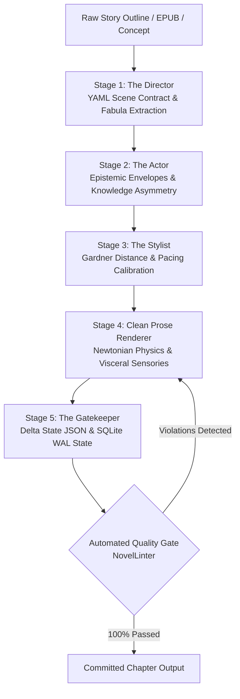

# 📖 AI Novel Engine (v2.0)

[](https://github.com/Jaswanth1902)
[](https://opensource.org/licenses/MIT)
[]()
[]()
[-purple.svg)]()

An autonomous, production-grade **5-Stage Director-Actor-Stylist Engine** designed to adopt, plan, and write long-form literary fiction with professional craft standards. 

Engineered by **Jaswanth Reddy ([@Jaswanth1902](https://github.com/Jaswanth1902))** to eradicate generic AI slop, purple prose, epistemic mind-reading, and repetitive crutch words, replacing them with authentic sensory physics, Gardner psychic distance control, and Newtonian martial choreography.

---

## 🏛️ Architecture: The 5-Stage Pipeline



### Stage Breakdown
1. **Stage 1 (The Director)**: Compiles formal YAML Scene Contracts from high-level intent. Fixes POV, ticking clocks, dramatic turning points, physical fabula, and sensory palettes.
2. **Stage 2 (The Actor)**: Builds epistemic envelopes for every character in the scene. Prevents telepathic mind-reading: characters only know what they have empirically witnessed or learned.
3. **Stage 3 (The Stylist)**: Configures John Gardner's Psychic Distance continuum (D1 Cinematic through D5 Metaphysical) and sets rhythmic sentence velocity.
4. **Stage 4 (Prose Generation)**: Drafts clean manuscript prose adhering strictly to somatic autonomic nervous reactions and Newtonian kinetic physics.
5. **Stage 5 (The Gatekeeper & Memory)**: Extracts Delta State JSON (injuries, inventory, timeline, secrets) and persists them into a local SQLite WAL database to guarantee zero continuity drift.

---

## 🛡️ The Craft Invariant Matrix

The engine runs a hard automated linter (`engine/linter.py`) that fails builds on any violation:

| Metric / Rule | Threshold | Engine Enforcement |
| :--- | :--- | :--- |
| **Filter Verbs** | **Zero Tolerance (0)** | Automatically bans `he felt`, `she felt`, `felt like`, `noticed that`, `he wondered`, `she realized`, `he decided`. Replaces with visceral autonomic tells. |
| **Em-Dash Density** | **$\le 1$ per 800 words** | Strictly caps em-dashes. Uses colons, semicolons, and varied sentence rhythms. Target: $\le 1$ dash per full chapter. |
| **Banned AI Cliches** | **Zero Tolerance (0)** | Bars generic filler: *testament to, tapestry of, delve, beacon of, symphony of, shivers down, cacophony, a dance of, intertwined, palpable tension*. |
| **Banned Faux-Archaic Crutches** | **Zero Tolerance (0)** | Explicitly bans repetitive crutch words: `scriptorium`, `portico`, `visage`, `countenance`, `ebon`, `eldritch`. |
| **Worldbuilding Anachronisms** | **Zero Tolerance (0)** | Enforces Avatar: The Last Airbender tech level (coal/steam, blacksmithing, well-water). Bars couches, tea (replaced by barley broth / roasted chicory), cigarettes, zippers, modern idioms. |
| **Martial Choreography** | **Newtonian Weight** | Strictly enforces conservation of momentum, torque, leverage, dielectric resistance, and thermodynamic gradients. |

---

## 🚀 Quick Start & CLI Usage

### Installation
```bash
git clone https://github.com/Jaswanth1902/AI_Novel_Engine.git
cd AI_Novel_Engine
pip install -r requirements.txt
```

### 1. Audit the Entire Manuscript
Run the automated quality linter against all clean chapters:
```bash
python novel_engine.py audit
# Or via installed module:
python -m engine.linter output
```

### 2. View Manuscript Statistics
Get comprehensive word count breakdowns, average chapter lengths, and pipeline status:
```bash
python novel_engine.py stats
```

### 3. Compile Chapters into a Unified Manuscript
Stitch all individual chapters into a single master document:
```bash
python novel_engine.py compile --out output/Complete_Manuscript.md
```

---

## 📚 Flagship Production: *The Mysteries of Life*

The engine's reference implementation is the complete reconstruction of the 144,000-word epic fantasy manuscript **The Mysteries of Life** by **Jaswanth Reddy**.

- **Current Published State**: **Chapters 1–36** (50,204 words)
- **Quality Gate Score**: **100% Passed (0 Filter Verbs, 0 Banned Cliches, 0 Banned Crutches, 9 Total Dashes across 50k words)**
- **Story Arc Overview**:
  - **Act I: The Awakening (Ch 1–10)**: The Honoured One awakes; cosmic comet alignment; the Unlit Ridge lightning deflection; the purge of the unawakened.
  - **Act II: The Subterranean Folio & Heresy (Ch 11–20)**: Unit 07 formation; discovery of Master Varun's forbidden grammar; constraint collapse; the testing duel; trial against veteran proctors Rao and Meera; dispatch to Vyadha Block.
  - **Act III: The Siege of Langford (Ch 21–30)**: Rail transit to Langford mining basin; liaison Lyra; water mill and orphanage breaches; Tier 3 Danava siege; Chaitanya's sacrificial plasma collapse; extraction of the wounded heroes.
  - **Act IV: The Recovery & Tournament Mobilization (Ch 31–36+)**: The silent vigil; Bennett's ice-anchoring; Tejaswini's thermal discipline; Chaitanya's meridian awakening; announcement of the Grand Selection Tournament.

---

## 📂 Repository Layout

```
AI_Novel_Engine/
├── config/
│   ├── rules.yaml              # Core craft rules, banned phrases & anachronism lists
│   └── style_presets.yaml      # Gardner continuum presets and pacing profiles
├── engine/
│   ├── __init__.py
│   ├── cli.py                  # Command-line interface
│   ├── core.py                 # Master orchestrator coordinating all stages
│   ├── director.py             # Stage 1: Scene contract compiler
│   ├── actor.py                # Stage 2: Epistemic character model
│   ├── stylist.py              # Stage 3 & 4: Prose craft and Gardner calibration
│   ├── gatekeeper.py           # Stage 5: Delta State verification & state commits
│   ├── linter.py               # Automated AST & lexical quality gate
│   └── memory.py               # SQLite WAL-backed story state tracking
├── state/
│   ├── MASTER_LORE_BIBLE.md    # Canonical lore, metaphysics, and elemental laws
│   └── story_state.sqlite      # Persistent chronological and character database
├── output/                     # 36 Polished Chapters & Pipeline Execution logs
├── scripts/
│   └── patch_violations.py     # Deterministic lint patcher utility
├── novel_engine.py             # Top-level executable entry point
├── pyproject.toml              # Modern Python packaging configuration
└── requirements.txt            # Lightweight dependencies (pyyaml, rich)
```

---

## 👤 Author & Maintainer

**Jaswanth Reddy**  
- GitHub: [@Jaswanth1902](https://github.com/Jaswanth1902)  
- Email: `jaswanthreddy1537@gmail.com`

---

## 📄 License
Licensed under the [MIT License](LICENSE).
