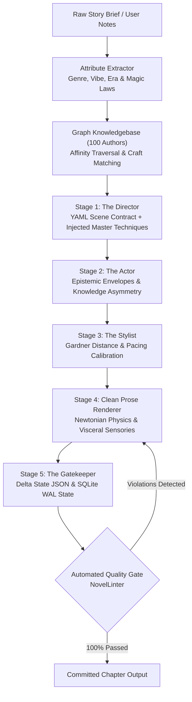

# 📖 AI Novel Engine (v2.0)

[](https://github.com/Jaswanth1902)
[](https://opensource.org/licenses/MIT)
[]()
[]()
[]()
[-purple.svg)]()

An autonomous, production-grade **5-Stage Director-Actor-Stylist Engine** with an integrated **Graph Knowledgebase of 100 Master Authors**, designed to extract narrative parameters from user notes, match reference books, and inject canonical craft techniques into long-form literary fiction.

Engineered by **Jaswanth Reddy ([@Jaswanth1902](https://github.com/Jaswanth1902))** to eliminate generic AI slop, purple prose, epistemic mind-reading, and repetitive crutch words, replacing them with authentic sensory physics, Gardner psychic distance control, and Newtonian martial choreography.

---

## 🏛️ Architecture: The 5-Stage Pipeline



### Stage Breakdown
1. **Stage 1 (The Director & Craft Injector)**: Extracts multi-dimensional narrative attributes, queries the 100-author graph knowledgebase, and compiles formal YAML Scene Contracts. Injects matched master techniques, reference books, and source repositories.
2. **Stage 2 (The Actor)**: Builds epistemic envelopes for every character in the scene. Prevents telepathic mind-reading: characters only know what they have empirically witnessed or learned.
3. **Stage 3 (The Stylist)**: Configures John Gardner's Psychic Distance continuum (D1 Cinematic through D5 Metaphysical) and injects the matched author craft directives into the prose rules.
4. **Stage 4 (Prose Generation)**: Drafts clean manuscript prose adhering strictly to somatic autonomic nervous reactions and Newtonian kinetic physics.
5. **Stage 5 (The Gatekeeper & Memory)**: Extracts Delta State JSON (injuries, inventory, timeline, secrets) and persists them into a local SQLite WAL database to guarantee zero continuity drift.

---

## 🌐 The 100 Authors Graph Knowledgebase

The engine features a dedicated, SQLite-backed graph database (`state/author_knowledge_graph.sqlite`) connecting:
- **100 Master Authors**: Spanning Classic, Hard Sci-Fi, Cyberpunk, Xianxia/Wuxia, Grimdark, LitRPG, Psychological Thriller, Horror, Historical, and Literary Modernism.
- **400 Signature Craft Techniques**: Concrete, actionable literary maneuvers (e.g., Sanderson's hard magic limits, King's visceral telepathy, McCarthy's elemental monosyllables, Le Guin's sentence music, Will Wight's zero-bloat martial choreography, Gibson's dense neologisms, Highsmith's amoral intimacy).
- **287 Reference Works**: Master novels and series mapped to specific genres and eras.
- **172 Verified Source Repositories**: Public archives (Standard Ebooks, Project Gutenberg, Royal Road, Wuxiaworld, Internet Archive) for studying prose patterns.

### Graph Metrics
- **Total Nodes**: 1,275
- **Total Edges**: 1,479
- **Connectivity**: 100% (Zero orphan nodes)

---

## 🛡️ The Craft Invariant Matrix

The engine runs a hard automated linter (`engine/linter.py`) that fails builds on any violation:

| Metric / Rule | Threshold | Engine Enforcement |
| :--- | :--- | :--- |
| **Filter Verbs** | **Zero Tolerance (0)** | Automatically bans `he felt`, `she felt`, `felt like`, `noticed that`, `he wondered`, `she realized`, `he decided`. Replaces with visceral autonomic tells. |
| **Em-Dash Density** | **$\ge 800$ words/dash** | Strictly caps em-dashes. Uses colons, semicolons, and varied sentence rhythms. Target: $\le 1$ dash per full chapter. |
| **Banned AI Cliches** | **Zero Tolerance (0)** | Bars generic filler: *testament to, tapestry of, delve, beacon of, symphony of, shivers down, cacophony, a dance of, intertwined, palpable tension*. |
| **Banned Faux-Archaic Crutches** | **Zero Tolerance (0)** | Explicitly bans repetitive crutch words: `scriptorium`, `portico`, `visage`, `countenance`, `ebon`, `eldritch`. |
| **Worldbuilding Anachronisms** | **Zero Tolerance (0)** | Enforces Avatar: The Last Airbender tech level (coal/steam, blacksmithing, well-water). Bars couches, tea (replaced by barley broth / roasted chicory), cigarettes, zippers, modern idioms. |
| **Martial Choreography** | **Newtonian Weight** | Strictly enforces conservation of momentum, torque, leverage, dielectric resistance, and thermodynamic gradients. |

---

## 🚀 Quick Start & CLI Usage

### Installation
```bash
git clone https://github.com/Jaswanth1902/AI_Novel_Engine.git
cd AI_Novel_Engine
pip install -r requirements.txt
```

### 1. Match Narrative Attributes & Reference Authors
Analyze freeform story notes, extract parameters, and pull reference authors & techniques:
```bash
python novel_engine.py match --text "A rogue hacker penetrates an orbital data fortress while cybernetic ice burns through his neural deck."
```

### 2. Plan a Scene with Graph Craft Injection
Compile a validated Stage 1 YAML Scene Contract from raw notes with live injected author techniques:
```bash
python novel_engine.py plan --chapter 37 --title "The Glass Lattice" --notes "Jaswanth discovers that the obsidian core of the tower is leaking current into subterranean aquifers."
```

### 3. Inspect Graph Knowledgebase Statistics
```bash
python novel_engine.py graph-stats
```

### 4. Audit Manuscript Quality
Run the automated anti-slop quality linter across all chapters:
```bash
python novel_engine.py audit
```

### 5. View Manuscript Statistics
Get comprehensive word counts and chapter metrics:
```bash
python novel_engine.py stats
```

### 6. Compile Chapters into a Single Manuscript
```bash
python novel_engine.py compile --out output/Complete_Manuscript.md
```

### 7. Run Pytest Verification
```bash
python -m pytest -o pythonpath=. tests/ -v
```

---

## 📚 Flagship Production: *The Mysteries of Life*

The engine's reference implementation is the complete reconstruction of the epic fantasy manuscript **The Mysteries of Life** by **Jaswanth Reddy**.

- **Current Published State**: **Chapters 1–36** (50,258 words)
- **Quality Gate Score**: **100% Passed across all 37 files** (0 Filter Verbs, 0 Banned Cliches, 0 Banned Crutches, 0 Anachronisms, 1 dash per 1,092 words)
- **Story Arc Overview**:
  - **Act I: The Awakening (Ch 1–10)**: The Honoured One awakes; cosmic comet alignment; the Unlit Ridge lightning deflection; the purge of the unawakened.
  - **Act II: The Subterranean Folio & Heresy (Ch 11–20)**: Unit 07 formation; discovery of Master Varun's forbidden grammar; constraint collapse; the testing duel; trial against veteran proctors Rao and Meera; dispatch to Vyadha Block.
  - **Act III: The Siege of Langford (Ch 21–30)**: Rail transit to Langford mining basin; liaison Lyra; water mill and orphanage breaches; Tier 3 Danava siege; Chaitanya's sacrificial plasma collapse; extraction of the wounded heroes.
  - **Act IV: The Recovery & Tournament Mobilization (Ch 31–36+)**: The silent vigil; Bennett's ice-anchoring; Tejaswini's thermal discipline; Chaitanya's meridian awakening; announcement of the Grand Selection Tournament.

---

## 📂 Repository Layout

```
AI_Novel_Engine/
├── config/
│   ├── rules.yaml                    # Core craft rules, banned phrases & anachronisms
│   ├── style_presets.yaml            # Gardner continuum presets and pacing profiles
│   ├── genre_matrix.yaml             # Multi-genre sensory palettes and tech era constraints
│   └── AUTHOR_CRAFT_DIRECTIVES.md    # Master literary rules and 100 author ontology
├── data/
│   └── authors_100.json              # 100 curated authors, techniques, works, and repositories
├── engine/
│   ├── __init__.py
│   ├── cli.py                        # Command-line interface with match, plan, audit, stats
│   ├── core.py                       # Master orchestrator coordinating all 5 stages
│   ├── attribute_extractor.py        # Extracts genre, vibe, era, and magic parameters
│   ├── graph_knowledge.py            # SQLite-backed 100-author knowledge graph
│   ├── director.py                   # Stage 1: Scene contract compiler & craft injector
│   ├── actor.py                      # Stage 2: Epistemic character modeling
│   ├── stylist.py                    # Stage 3 & 4: Prose craft and Gardner calibration
│   ├── gatekeeper.py                 # Stage 5: Delta State verification & state commits
│   ├── linter.py                     # Automated AST & lexical quality gate
│   └── memory.py                     # SQLite WAL-backed story state tracking
├── state/
│   ├── MASTER_LORE_BIBLE.md          # Canonical lore, metaphysics, and elemental laws
│   ├── author_knowledge_graph.sqlite # Pre-compiled knowledge graph database
│   └── story_state.sqlite            # Persistent chronological and character database
├── output/                           # 36 Polished Chapters & Pipeline Execution logs
├── tests/
│   └── test_novel_engine.py          # Automated pytest test suite
├── novel_engine.py                   # Top-level executable entry point
├── pyproject.toml                    # Modern Python packaging configuration
└── requirements.txt                  # Dependencies (pyyaml, rich, pytest)
```

---

## 👤 Author & Maintainer

**Jaswanth Reddy**  
- GitHub: [@Jaswanth1902](https://github.com/Jaswanth1902)  
- Email: `jaswanthreddy1537@gmail.com`

---

## 📄 License
Licensed under the [MIT License](LICENSE).
