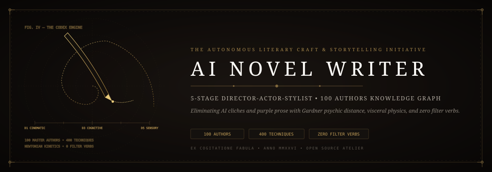
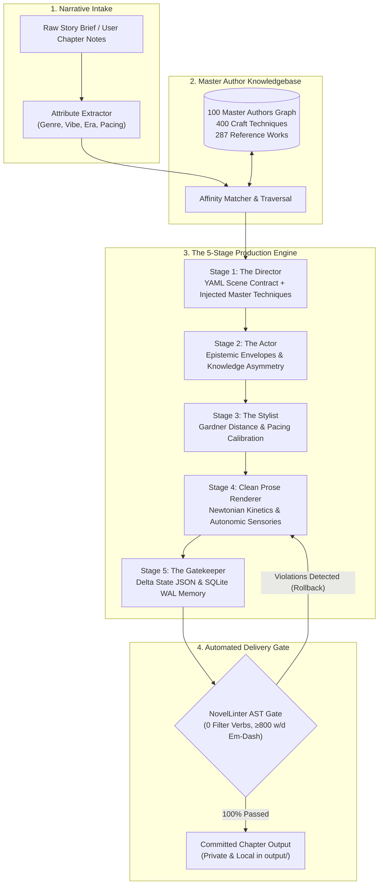
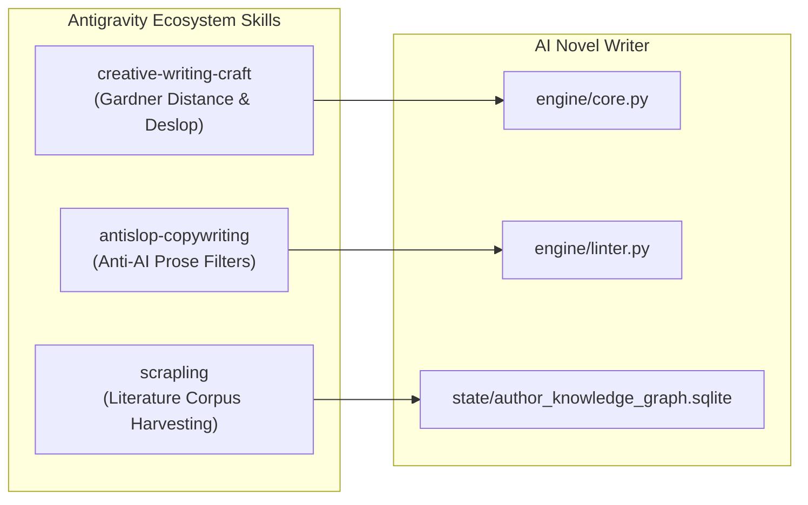

<p align="center">
  
</p>

# 🖋️ AI Novel Writer — The Autonomous Literary Craft & Storytelling Initiative

[](https://github.com/Jaswanth1902)
[-blue?style=flat-square)](https://github.com/Jaswanth1902/AI_Novel_Engine)
[](https://github.com/Jaswanth1902/AI_Novel_Engine)
[](state/author_knowledge_graph.sqlite)
[](engine/linter.py)
[](engine/linter.py)
[-purple.svg?style=flat-square)](output/)
[](LICENSE)
[](SECURITY.md)

**AI Novel Writer** is an open creative initiative and computational literary framework designed to eliminate generic AI prose, epistemic mind-reading, and purple cliches from generative fiction. Driven by the **AI Novel Engine (v2.0)**, it couples an autonomous **5-Stage Director-Actor-Stylist Pipeline** with an AST-grounded **Graph Knowledgebase of 100 Master Authors**, enforcing authentic sensory physics, John Gardner psychic distance calibration, and strict anti-slop quality gates.

Conceived and engineered by **Jaswanth Reddy ([@Jaswanth1902](https://github.com/Jaswanth1902))** as an open-source initiative to restore timeless storytelling craftsmanship to AI-assisted long-form narrative art.

---

## 💡 The Creative Initiative Manifesto

### Why AI Novel Writer?
Most contemporary "AI writing" tools operate on raw prompt-in, token-out regurgitation. The resulting manuscripts suffer from predictable, catastrophic failures:
1. **The Telepathic Narrator**: Characters mysteriously deduce each other's secret thoughts and unspoken motives without empirical evidence.
2. **Filter Verb Epidemic**: Sentences are bogged down by weak perceptual filters (*"he felt the cold"*, *"she noticed the shadow"*, *"he wondered if"*).
3. **Punctuation & Crutch Overuse**: Pervasive em-dash addiction, repetitive faux-archaic vocabulary (*scriptorium, portico, visage, countenance*), and dramatic ellipses that ruin reader immersion.
4. **Floating Heads & Zero Physics**: Action scenes lack Newtonian kinetics—ignoring inertia, leverage, momentum conservation, and physiological muscle exhaustion.
5. **Continuity Drift**: Characters heal from amputations between chapters, inventory items evaporate, and elemental magic systems contradict their own rules.

### The Craft Solution
**AI Novel Writer** treats fiction not as unstructured text generation, but as a **formal architectural simulation**:
- **Epistemic Envelopes**: Characters are modeled with strict information boundaries—they can only act on what they have directly perceived or empirically deduced.
- **Autonomic Telling**: Internal sensations replace filter verbs (e.g., blood vessels constricting in the fingertips instead of *"he felt afraid"*).
- **Newtonian Kinetics**: Physical martial choreography adheres to conservation of momentum, torque, and thermodynamic friction.
- **John Gardner's Continuum**: Psychic distance smoothly modulates across 5 distinct focal depths ($D_1$ through $D_5$).
- **Deterministic SQLite Memory**: An ACID-compliant Write-Ahead Log (WAL) tracks all injuries, inventory, alliances, and world state chronologically.

---

## 🏛️ Architecture: The 5-Stage Production Pipeline



### Pipeline Execution Stages
1. **Stage 1 (The Director & Craft Injector)**: Analyzes the narrative prompt, extracts genre/era/vibe dimensions, queries the 100-author knowledge graph, and compiles a formal YAML Scene Contract injecting matched author techniques.
2. **Stage 2 (The Actor)**: Establishes epistemic boundaries for every character present. Restricts observation to immediate sightlines, physical hearing range, and prior disclosed knowledge.
3. **Stage 3 (The Stylist)**: Establishes John Gardner's psychic distance ($D_1$ cinematic pan to $D_5$ visceral stream-of-consciousness) and embeds specific syntactic cadence directives.
4. **Stage 4 (Prose Renderer)**: Synthesizes high-fidelity prose obeying kinetic momentum, biological sensory tells, and dialogue subtext.
5. **Stage 5 (The Gatekeeper & Continuity Memory)**: Extracts inventory transfers, health deltas, revelations, and chronological shifts into persistent SQLite storage.

---

## 🌐 The 100 Master Authors Knowledge Graph

The engine's narrative intelligence is anchored by a dedicated, local SQLite graph database (`state/author_knowledge_graph.sqlite`):

```
┌──────────────────────────────────────────────────────────────┐
│            AUTHOR KNOWLEDGEBASE GRAPH TOPOLOGY               │
├────────────────────────────────┬─────────────────────────────┤
│ Metric                         │ Value                       │
├────────────────────────────────┼─────────────────────────────┤
│ Total Nodes                    │ 1,275                       │
│ Total Edges                    │ 1,479                       │
│ Master Authors                 │ 100 (Classic & Modern)      │
│ Signature Craft Techniques     │ 400 Actionable Maneuvers    │
│ Mapped Reference Works         │ 310 Canonical Novels        │
│ Genres & Sensory Palettes      │ 140 Sub-genres              │
│ Atmospheric Vibes & Tones      │ 291 Distinct Ambiances      │
│ Technological Eras             │ 34 Historical / Future Eras │
│ Graph Connectivity             │ 100% (Zero Orphan Nodes)    │
└────────────────────────────────┴─────────────────────────────┘
```

### Representative Craft Techniques in the Graph
- **Brandon Sanderson**: Hard magic cost-benefit boundaries, mechanical sensory feedbacks.
- **Cormac McCarthy**: Elemental polysyndeton, rhythmic biblical cadence, landscape animism.
- **Ursula K. Le Guin**: Anthropological psychic distance, ecological language layering.
- **William Gibson**: Dense technobabble neologisms, tactile cold cybernetic visceral textures.
- **Raymond Chandler**: Objective camera focalization, hardboiled metaphorical compression.
- **Will Wight**: Zero-bloat progression dynamics, kinetic escalation, clear physical stakes.
- **Shirley Jackson**: Unreliable psychic focalization, domestic architectural claustrophobia.

---

## 🛡️ The Craft Invariant Matrix (Zero-Tolerance Linter)

The engine enforces an uncompromising quality gate (`engine/linter.py`) before any chapter is accepted:

| Invariant / Metric | Standard | Enforcement Behavior |
| :--- | :--- | :--- |
| **Filter Verbs** | **Zero Tolerance (0)** | Strictly bans: `he felt`, `she felt`, `felt like`, `noticed that`, `he wondered`, `she realized`, `he decided`. Replaces with autonomic sensations. |
| **Em-Dash Density** | **$\ge 800$ words/dash** | Caps punctuation frequency. Requires colons, semicolons, or rhythmic commas instead of conversational dashes. Target: $\le 1$ dash per full chapter. |
| **Banned AI Cliches** | **Zero Tolerance (0)** | Automatically rejects: *testament to, tapestry of, delve, beacon of, symphony of, shivers down, cacophony, a dance of, intertwined, palpable tension*. |
| **Faux-Archaic Crutches** | **Zero Tolerance (0)** | Rejects repetitive historical crutches: *scriptorium, portico, visage, countenance, ebon, eldritch*. |
| **Worldbuilding Fidelity** | **Zero Anachronisms** | Strict era physics. For pre-industrial settings, bars couches, modern plumbing, cigarettes, zippers, or 21st-century psychological jargon. |
| **Action & Martial Physics**| **Newtonian Mechanics** | Conserves kinetic energy, lever action, balance recovery intervals, and biological fatigue. |

---

## 🚀 Quick Start & Workflow

### 1. Installation
```bash
git clone https://github.com/Jaswanth1902/AI_Novel_Engine.git
cd AI_Novel_Engine
pip install -r requirements.txt
```

### 2. Match Narrative Concept Against the Graph
Extract story attributes and discover author craft techniques tailored to your premise:
```bash
python novel_writer.py match --text "A disgraced biomechanical archivist explores a flooded subterranean vault beneath a ruined starport."
```

### 3. Plan a Scene Contract
Generate a validated Stage 1 YAML Scene Contract injecting author craft guidelines:
```bash
python novel_writer.py plan --chapter 1 --title "The Subterranean Vault" --notes "Kael navigates the salt-crusted hydraulic shafts of Langford Station."
```

### 4. Audit Manuscript for AI Cliches & Filter Verbs
Run the automated anti-slop linter across your chapters:
```bash
python novel_writer.py audit
```

### 5. Inspect Manuscript Word Counts & Metrics
```bash
python novel_writer.py stats
```

### 6. Compile Chapters into a Single Manuscript
```bash
python novel_writer.py compile --out output/Complete_Manuscript.md
```

### 7. Run Unit Tests
```bash
pytest
```

---

## 🔌 Antigravity Skills Integration

AI Novel Writer connects directly with the Antigravity Agent ecosystem:



- **[`creative-writing-craft`](file:///C:/Users/jaswa/Antigravity/.agents/skills/creative-writing-craft/SKILL.md)**: Governs psychic distance calibration, free indirect discourse, scene economy, and 3-pass narrative optimization.
- **[`antislop-copywriting`](file:///C:/Users/jaswa/Antigravity/.agents/skills/antislop-copywriting/SKILL.md)**: Provides lexicons and phonetic cadences to strip AI-tell markers from narrative text.
- **[`scrapling`](file:///C:/Users/jaswa/Antigravity/.agents/skills/scrapling/SKILL.md)**: Scrapes public domain classical texts (Standard Ebooks, Project Gutenberg) to harvest stylistic syntax distributions.

---

## 🔒 Manuscript Privacy & Local-First Commitment

Your creative writing is your intellectual property. AI Novel Writer is engineered for complete privacy:

- **100% Local Execution**: Operates locally with zero analytics, telemetry, or external tracking beacons.
- **Git-Ignored Creative Vault**: All generated chapters (`output/chapters/`), pipeline logs (`output/pipeline_logs/`), and story databases are strictly excluded from git tracking via `.gitignore`.
- **Air-Gapped LLM Ready**: Fully compatible with local inference runtimes (*Ollama*, *vLLM*, *llama.cpp*) via standard OpenAI-compatible endpoints.

See [`SECURITY.md`](SECURITY.md) for our complete security and responsible disclosure policy.

---

## 📂 Repository Layout

```
AI_Novel_Engine/
├── assets/
│   ├── novel_writer_banner.svg       # Atelier Aesthetic wide banner (vector SVG)
│   ├── novel_writer_logo.svg         # Atelier Aesthetic square monogram mark
│   └── characters/                   # Visual character cards and reference art
├── config/
│   ├── rules.yaml                    # Banned words, filter verb lists, anachronism rules
│   ├── style_presets.yaml            # Gardner distance presets and pacing curves
│   ├── genre_matrix.yaml             # Multi-genre sensory palettes and tech era boundaries
│   └── AUTHOR_CRAFT_DIRECTIVES.md    # Master literary guidelines and 100-author ontology
├── data/
│   └── authors_100.json              # 100 master authors, 400 techniques, 310 reference works
├── engine/
│   ├── __init__.py
│   ├── cli.py                        # Command-line interface with match, plan, audit, stats
│   ├── core.py                       # Orchestrator coordinating all 5 pipeline stages
│   ├── attribute_extractor.py        # Parameter extractor for genre, vibe, and era
│   ├── graph_knowledge.py            # SQLite knowledge graph interface
│   ├── director.py                   # Stage 1: Scene contract generator & craft injector
│   ├── actor.py                      # Stage 2: Epistemic character modeler
│   ├── stylist.py                    # Stage 3 & 4: Prose craft & Gardner distance calibrator
│   ├── gatekeeper.py                 # Stage 5: Delta State persistence & state verification
│   ├── linter.py                     # Automated anti-slop lexical & grammatical linter
│   └── memory.py                     # SQLite WAL story state tracking
├── state/
│   ├── MASTER_LORE_BIBLE.md          # Canonical universe rules, metaphysics, factions
│   ├── author_knowledge_graph.sqlite # SQLite database containing 1,275 nodes & 1,479 edges
│   └── story_state.sqlite            # Persistent character timeline and delta state database
├── output/                           # Local private creative vault (git-ignored)
├── tests/
│   └── test_novel_engine.py          # Automated pytest validation suite (8 tests)
├── novel_writer.py                   # Primary executable entrypoint for the creative initiative
├── novel_engine.py                   # Legacy engine entrypoint
├── pyproject.toml                    # Modern PEP 517/621 packaging with pytest configuration
├── requirements.txt                  # Lightweight dependencies (pyyaml, rich, pytest)
├── CONTRIBUTING.md                   # Contribution guidelines for craft techniques & rules
├── SECURITY.md                       # Security & manuscript privacy disclosure policy
└── LICENSE                           # MIT License
```

---

## 👤 Author & Maintainer

**Jaswanth Reddy**  
- **GitHub**: [@Jaswanth1902](https://github.com/Jaswanth1902)  
- **Email**: `jaswanthreddy1537@gmail.com`  
- **Philosophy**: *Crafting thoughtful software, ambient interfaces, and autonomous systems to elevate everyday quality of life.*

---

## 📄 License

Licensed under the [MIT License](LICENSE).
