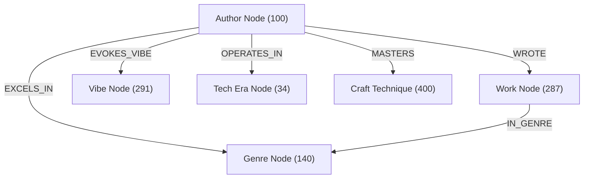

# 📜 Master Author Craft Directives & Genre Adaptation Matrix
**Author**: Jaswanth Reddy ([@Jaswanth1902](https://github.com/Jaswanth1902))  
**Engine**: AI Novel Engine v2.0  
**Status**: Formal Quality Standard

---

## 1. The Masters' Synthesized Directives

The AI Novel Engine synthesizes the core philosophies of modern and classic literary masters into deterministic, enforceable machine rules:

### A. Brandon Sanderson (Laws of Magic & Narrative Architecture)
1. **First Law of Magic (The Understanding Ratio)**:
   - An author's ability to solve conflict satisfactorily with magic is directly proportional to how well the reader understands the rules, costs, and consequences of that magic.
   - *Engine Rule*: If a magic or technological capability resolves a scene's climax, its limitations and mechanics must have been empirically introduced in a prior chapter.
2. **Second Law of Magic (Limitations > Powers)**:
   - Weaknesses, costs, and failure states create 10x more dramatic tension than raw destructive capability.
   - *Engine Rule*: Every supernatural or technological exertion must extract a physical, biological, or social toll (e.g., meridian stress, hypothermia, ammo depletion, sensory burnout).
3. **Third Law of Magic (Extrapolate Before Adding)**:
   - Do not invent twenty disconnected magical concepts. Take two fundamental axioms and extrapolate their economic, cultural, and military consequences to the absolute extreme.
4. **Zeroth Law (Grounded Awesomeness)**:
   - Err on the side of what is thrilling, but anchor it so firmly in Newtonian physics and tactical leverage that it feels inevitable.
5. **The Narrative Triangle (Promises, Progress, Payoff)**:
   - *Promise*: Chapter 1 establishes the tonal contract and stakes.
   - *Progress*: The middle displays measurable, non-linear forward momentum with clear setback-recovery loops.
   - *Payoff*: The climax pays off the specific promises made at the threshold.

### B. Stephen King (Visceral Grounding & Prose Hygiene)
1. **Adverb Decimation**: Adverbs (especially dialogue tags like *she said angrily*) are crutches. The action and dialogue must convey the emotion.
2. **Telepathic Transmission**: Prose is not decorative; it is the instantaneous projection of physical sensation from one mind to another.
3. **Kill Your Darlings**: If a sentence exists purely because the writer thinks it sounds pretty, delete it.
4. **Description as Iceberg**: Supply three razor-sharp physical details (smell of horse sweat, dented iron rivet, sour chicory dregs) and let the reader’s mind construct the rest.

### C. Ursula K. Le Guin (Acoustic Texture & Point of View Integrity)
1. **The Music of the Sentence**: Sentences must have phonetic cadence and rhythmic variation. Long, flowing clauses for contemplation; short, percussive monosyllables for impact.
2. **POV Integrity**: Absolute prohibition against "head-hopping." A scene stays in one skull. If the POV character is knocked out or leaves the room, the camera stays with them.
3. **Punctuation as Breath**: Punctuation is not grammatical bureaucracy; it is the notation for human respiration.

### D. George R.R. Martin (Historical Grit & Grey Morality)
1. **Logistical Realism**: Battles are decided by mud, dysentery, rusted horseshoes, supply wagons, and frostbite before swords even clash.
2. **The Human Heart in Conflict With Itself**: Every antagonist has an internally coherent worldview and a family or code they believe they are protecting.
3. **Physical Consequences**: Injuries do not vanish between chapters. Broken bones take weeks to knit; burns leave permanent disfigurement; concussions cause vomiting and dizziness.

### E. Cormac McCarthy (Elemental Minimalism & Somatic Weight)
1. **Stripped Ornamentation**: Eliminate fussy interior monologue tags. Render character consciousness through external physical interaction with the landscape.
2. **Landscape as Titan**: The terrain (mountains, storm, desert, canal) is never background wallpaper; it is an unyielding, indifferent physical antagonist.
3. **Biblical Cadence**: Ground descriptions in stark, ancient, monosyllabic Anglo-Saxon root words rather than bloated Latinate adjectives.

---

## 2. Multi-Genre Adaptation Matrix

The engine dynamically recalibrates its stylistic parameters based on the target genre:

| Genre | Primary Conflict Vector | Cadence & Sentence Rhythm | Sensory Palette Focus | Banned Tropes & Slop |
| :--- | :--- | :--- | :--- | :--- |
| **Epic Fantasy** | Sociopolitical destiny vs systemic decay | Balanced, architectural, layered | Cold iron, tallow, stone dust, damp vellum, ozone | Instant unearned godhood, modern democratic colloquialisms |
| **Grimdark Military** | Biological survival against overwhelming mass | Staccato, percussive, abrupt | Blood, vinegar bandages, wet wool, sulfur, bile | Clean deaths, noble monologues, flawless armor |
| **Hard Sci-Fi** | Human intellect against thermodynamics/physics | Clinical, exact, analytical | Cryo-vapor, hydraulic oil, ionizing radiation, vacuum | Faster-than-light hand-waving, sound in space, magic techno-babble |
| **Cyberpunk** | Individual autonomy vs corporate hegemony | Kinetic, syncopated, rhythmic | Ozone, wet asphalt, scorched synthetic rubber, neon flicker | Romanticizing poverty, pure good vs evil mega-corps |
| **Progression / Xianxia** | Willpower breaking cosmic constraints | Ascending intensity, martial focus | Core resonance, marrow heat, crystalline frost, jade | Instant breakthroughs without physical toll, endless arrogant young masters |
| **Mystery / Noir** | Information asymmetry & moral compromise | Laconic, atmospheric, sharp | Stale tobacco, rain on glass, wet trench coats, sour chicory | Omniscient detectives, clues withheld from reader |
| **Cosmic / Weird Horror** | Fragility of human reason vs vast uncaring cosmos | Creeping, suffocating, claustrophobic | Damp brine, rotting kelp, sulfur, cold cellar stone, incense | Tame comprehensible monsters, triumphant gun-based resolutions |
| **Literary Realism** | Individual regret vs unlived life | Luminous, reflective, fluid | Dust in sunlight, creaking floorboards, drying paint | Melodramatic explosive speeches, forced neat resolutions |

---

## 3. Vibe & Atmospheric Calibration

The Stylist configures emotional and tonal axes dynamically:

```yaml
vibe_profiles:
  grimdark_visceral:
    humor_ratio: 0.10 # Dark, cynical trench humor only
    fatigue_decay_rate: high # Physical fatigue compounds across scenes
    wound_permanence: strict # Scars, limp, missing teeth persist
    dialogue_subtext: "Self-preservation and weary camaraderie"

  high_wonder_mythic:
    humor_ratio: 0.20 # Warm, philosophical
    fatigue_decay_rate: moderate
    sensory_sublime: high # Vast scale, celestial bodies, ancient ruins
    dialogue_subtext: "Reverence for the unknown, weight of lineage"

  noir_melancholy:
    humor_ratio: 0.15 # Dry irony, gallows wit
    fatigue_decay_rate: high
    atmosphere_density: oppressive # Fog, endless rain, shadows
    dialogue_subtext: "Regret, transactional survival, unspoken grief"

  martial_asceticism:
    humor_ratio: 0.15 # Spartan, sparring-ground banter
    fatigue_decay_rate: realistic
    kinetic_focus: extreme # Torque, footwork, breath count
    dialogue_subtext: "Tactical respect, unspoken blood-oaths"
```

---

## 4. Technological Settings & Anachronism Gatekeeper

The Linter enforces strict chronological vocabularies. Using an out-of-era word immediately fails the quality gate:

### Tier 1: Stone / Bronze Age
- **Permitted**: Flint, obsidian, hide, bone, sinew, clay, tallow, hearth, wicker, bronze axe.
- **Strictly Banned**: Steel, iron, parchment, paper, glass windows, carriages, books, gunpowder.

### Tier 2: Classical / High Medieval
- **Permitted**: Forged iron, steel, chainmail, vellum, quill, torch, wax seal, horse-cart, stone bastion.
- **Strictly Banned**: Steam engines, coal locomotives, printing press, pocket watches, tea, coffee, couches.

### Tier 3: Industrial / Steampunk (The ATLA Baseline)
- **Permitted**: Coal-fired steam locomotives, iron rails, riveted boilers, graphite grease, whale oil, tallow lamps, telegraph wires, sulfur flares, watermills.
- **Strictly Banned**: Couches, tea/coffee (use barley broth, roasted chicory), zippers, plastics, modern idioms, combustion cars, electronic lights.

### Tier 4: Victorian / Gaslamp
- **Permitted**: Gas lamps, cobblestones, steamships, telegraph, pocket chronometers, linen collars, carriage cabs.
- **Strictly Banned**: Computers, nylon, digital screens, radar, modern slang.

### Tier 5: Modern / Cyberpunk / Far-Future
- **Permitted**: Fiber optics, sub-orbital shuttles, synthetic neural mesh, vacuum chambers, plasma conduits, silicon.
- **Strictly Banned**: Feudal deference without satirical context, unexplained supernatural phenomena without physics grounding.

---

## 5. Negative Lexical Directives (Permanent Hard Bans)

The following words and expressions are permanently blacklisted across all genres:
1. **Faux-Archaic Crutches**: `scriptorium`, `portico`, `visage`, `countenance`, `ebon`, `eldritch`.
2. **AI Telling Cliches**: `testament to`, `tapestry of`, `delve`, `beacon of`, `symphony of`, `shivers down spine`, `cacophony`, `labyrinthine`, `a dance of`, `intertwined`, `palpable tension`, `steely resolve`.
3. **Filter Verbs**: `he felt`, `she felt`, `felt like`, `he noticed`, `she noticed`, `he wondered`, `she realized`, `he decided`.

---

## 6. The 100 Authors Master Knowledge Graph

The engine maintains a curated SQLite graph database (`state/author_knowledge_graph.sqlite`) containing:
- **100 Curated Authors**: Spanning classic, modern, literary, speculative, and web novel masters.
- **400 Signature Craft Techniques**: Concrete, actionable craft directives indexed per author.
- **287 Reference Works**: Canonical novels, sagas, and collections.
- **140 Unique Genres & Subgenres**.
- **291 Tonal Vibes & Atmospheres**.
- **34 Technological Eras**.
- **172 Verified Public Text Repositories & Study Archives**: Standard Ebooks, Project Gutenberg, Royal Road, Wuxiaworld, Internet Archive, and official author research logs.

### Graph Ontology & Edge Relations


---

## 7. Graph-Powered Craft Injection Workflow

When a user submits scene notes or chapter prompts, the pipeline executes a deterministic 3-step synthesis:

1. **Attribute Extraction (`AttributeExtractor`)**:
   - Parses the input text across lexical clusters to extract primary/secondary genres, tonal vibes, technological era, magic hardness, and pacing cadence.
2. **Graph Affinity Traversal (`GraphKnowledgebase`)**:
   - Walks graph edges with weighted priority:
     $$\text{Score} = (12.0 \times \text{Genre}) + (4.0 \times \text{Secondary}) + (3.0 \times \text{Vibe}) + (2.0 \times \text{Era}) + (3.0 \times \text{Magic})$$
   - Identifies the Top $K$ closest literary masters and extracts their reference books and signature craft techniques.
3. **Contract & Prose Injection (`Director` & `Stylist`)**:
   - Injects the matched techniques into the Stage 1 YAML Scene Contract under `craft_injection`.
   - Incorporates the techniques directly into Stage 3 Stylist rules, ensuring the prose actively mirrors the master authors' sensory, structural, and syntactic strengths while strictly adhering to all quality gate invariants.
